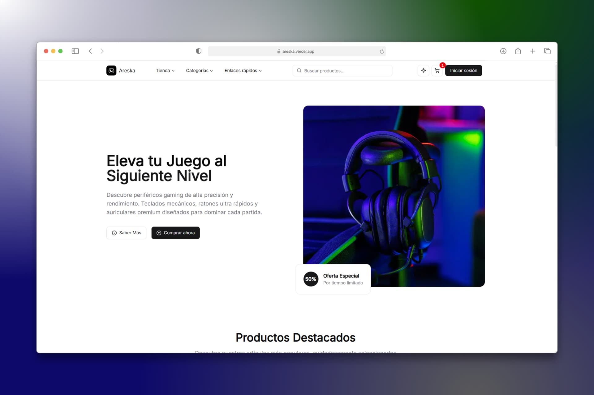

<div align="center">
  <a href="https://areska.vercel.app">
    
  </a>
  <p></p>
</div>

## Autenticación con Firebase

Este proyecto incluye integración con Firebase Auth para iniciar sesión con email/contraseña y Google.

1. Crea un proyecto en Firebase y habilita los proveedores "Email/Password" y "Google" en Authentication.
2. Copia las credenciales Web (SDK) y crea un archivo `.env.local` en la raíz con:

```
NEXT_PUBLIC_FIREBASE_API_KEY=
NEXT_PUBLIC_FIREBASE_AUTH_DOMAIN=
NEXT_PUBLIC_FIREBASE_PROJECT_ID=
NEXT_PUBLIC_FIREBASE_STORAGE_BUCKET=
NEXT_PUBLIC_FIREBASE_MESSAGING_SENDER_ID=
NEXT_PUBLIC_FIREBASE_APP_ID=
```

3. Rutas/páginas afectadas:
  - Login: `features/auth/pages/login` (email y Google)
  - Registro: `features/auth/pages/signup`
  - Recuperar contraseña: `features/auth/pages/forgot-password`
  - Restablecer contraseña: `features/auth/pages/reset-password` (usa `oobCode` del enlace de Firebase)

El listener de sesión de Firebase se inicializa en `app/(auth)/layout.tsx` y también en la `Navbar`.

<div align="center">


</div>
